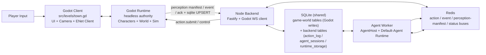

# System Architecture

> 基于当前仓库代码结构整理，覆盖 Godot 客户端/运行时、模拟域、UI、Node 后端、数据与关键运行链路。本文重点描述**已经在代码中落地的结构**，不替代各专题设计文档。

## 1. 文档目的

- 给新加入项目的人一张“先看哪里、各模块负责什么、怎么串起来”的总览图
- 给后续演进提供当前架构基线，避免只看专题文档却缺少全局上下文
- 明确当前主干代码所在位置，区分“已接入运行链路”和“预留/未来扩展目录”

## 2. 系统全景

当前项目是一个**三进程协作架构**：

- `Godot client` 负责玩家输入、渲染、HUD、本地交互面板
- `Godot runtime (headless server)` 负责权威世界状态、角色物理、作物推进、工作站/农场执行
- `Node.js backend` 负责连接 Godot agent WebSocket、action 投递、world event 入库、perception manifest 转发、HTTP / debug 接口
- `Agent worker` 负责订阅事件 / perception manifest、按 manifest id 列表 SELECT 共享 sqlite 真值表、运行 two-track-agent session、调用 LLM 与工具并提交 action
- `SQLite + Redis` 负责持久化、action / event / perception-manifest pubsub、worker ↔ gateway 协调



## 3. 启动与运行模式

### 3.1 Godot 入口

- 主场景入口定义在 `project.godot`：`run/main_scene="res://src/boot/boot.tscn"`
- [src/boot/boot.gd](../../src/boot/boot.gd) 只做一件事：统一切换到 `src/levels/town.tscn`
- **同一份 `town.tscn` 同时服务 client 和 runtime**，运行差异由 `RunMode` autoload 决定

### 3.2 Autoload 基础设施

`project.godot` 当前注册的核心 autoload：

- `RunMode`：区分 `runtime` / `client`，并携带 ENet 端口、townId、client 连接目标等启动参数
- `EventBus`：客户端 UI 和局部系统之间的信号总线
- `GameClock`：游戏时间与 `slow_tick`
- `BackendRuntimeClient`：仅 headless runtime 启用，在 Godot 侧监听 agent-host WebSocket，供 Node backend 连接
- `Materials` / `Verbs` / `Shapes` / `Workstations` / `Reactions`：从 `data/*.tres` 加载规则资源，形成只读注册表

### 3.3 单场景双形态

[src/levels/town.gd](../../src/levels/town.gd) 是当前运行时编排中心：

- `runtime` 模式：
  - 启动 ENet server
  - 作为多人同步权威端
  - 注册 `GameClock.slow_tick`
  - 生成玩家 avatar、推进角色/作物/农场 slow tick
- `client` 模式：
  - 连接 runtime ENet server
  - 初始化 HUD、Inventory、ActionPanel、FarmPanel、调试面板
  - 绑定本地玩家相机
  - 计算玩家与农场 proximity，并通过 `EventBus` 通知 UI

## 4. Godot 侧模块分层

### 4.1 场景与编排层

关键位置：

- [src/boot](../../src/boot)
- [src/levels](../../src/levels)
- [src/autoload](../../src/autoload)

职责：

- 进程启动与模式切换
- 全局单例注册
- 运行时主循环、多人同步、客户端 UI 挂载
- agent-host WebSocket 监听与世界事件转发

这一层不实现具体玩法规则，主要负责把“世界、角色、UI、后端通信”粘起来。

### 4.2 世界与导航层

关键位置：

- [src/world/town_world.gd](../../src/world/town_world.gd)
- [src/world/location_graph.gd](../../src/world/location_graph.gd)
- [src/world/location_corridor_planner.gd](../../src/world/location_corridor_planner.gd)
- [src/world/region_map.gd](../../src/world/region_map.gd)
- [src/world](../../src/world) 下的区域/网格相关脚本（如 `map_grid.gd`、`map_region.gd`、`region_rect.gd`）

职责：

- 维护 town 级 location tree、地点别名、owner group 可见性
- 把 `Positions`/`Waypoints`/`WorkstationNode`/`FarmGroup` 编成可查询地点索引（`FarmGroup` 与 `WorkstationNode` 同模型：自带 `Approach` Marker3D 子节点作为 NPC 寻路抵达点，注册 id 由各自的 `effective_*_id()` 提供）
- 在 runtime 启动后异步 bake location/waypoint 图，供 NPC/Player 分层寻路
- 提供“大地点 -> 子地点 -> 导航跳点”的空间抽象

架构特点：

- Location 和 Waypoint 都会作为 A* 图节点；Waypoint 是额外的路网控制点
- 地点可见性与导航分离：agent 看见什么地点，不等于 path graph 怎么走
- `TownWorld` 只在 runtime 端做 bake，client 不重复计算

### 4.3 角色与权威行为层

关键位置：

- [src/characters/character.gd](../../src/characters/character.gd)
- [src/characters/player/player.gd](../../src/characters/player/player.gd)
- [src/characters/npcs/npc.gd](../../src/characters/npcs/npc.gd)

职责分层：

- `Character`
  - 统一生命、体力、饥饿、条件、背包、感知、说话气泡、农事队列基础能力
  - 定义 backend 角色身份、上下文快照、周边实体感知等共享接口
- `Player`
  - server-authoritative 玩家 avatar
  - 处理移动、分层寻路、step assist、背包同步、工作台 staging、craft 执行
  - 把玩家自然语言输入转成 `player.command` 送往 backend
- `NPC`
  - 接收 backend action 驱动移动与即时动作
  - 维护可视 mesh、基础灵魂数据、plan_farm_work 等 AI 行为落点

架构特点：

- **物理与权威执行只在 runtime 端运行**
- client 上的角色副本主要用于渲染和 UI 绑定
- 玩家与 NPC 共用 `Character` 基类，减少“AI 角色”和“玩家角色”能力裂缝

### 4.4 模拟与规则层

关键位置：

- [src/sim/crafting](../../src/sim/crafting)
- [src/sim/crops](../../src/sim/crops)
- [src/sim/items](../../src/sim/items)
- [src/sim/materials](../../src/sim/materials)
- [src/sim/shapes](../../src/sim/shapes)
- [src/sim/verbs](../../src/sim/verbs)
- [src/sim/workstations](../../src/sim/workstations)
- [data](../../data)

核心机制：

- `Materials` / `Shapes` / `Verbs` / `Workstations` / `Reactions` autoload 在启动时扫描 `data/*.tres`
- [src/sim/crafting/crafting_dispatcher.gd](../../src/sim/crafting/crafting_dispatcher.gd) 基于反应表匹配输入、计算输出与失败结果
- [src/sim/crops/farm_group.gd](../../src/sim/crops/farm_group.gd) 管理一片农田的 slot、虫害上限、context dump；从 [src/sim/crops/farm_group.tscn](../../src/sim/crops/farm_group.tscn) prefab 实例化（自带 `Approach` Marker3D，由 town.tscn 里 designer 拖到田边 navmesh 上）。注册 logical location 由 [src/world/town_world.gd](../../src/world/town_world.gd) `_register_farms` 接管——FarmGroup 已取代原 `Positions/<owner>/<farm_id>` LocationMarker 叶子节点的角色，避免双 anchor 不一致
- `GameClock.slow_tick` 驱动饥饿衰减、作物生长、虫害判定等低频模拟

这层的设计重点是：

- 规则数据尽量外置为 `.tres`
- 运行时代码负责解释和执行资源，不把具体配方/材料写死在逻辑里
- 玩家与 NPC 共用同一套物品、反应、工作站和农场规则

### 4.5 UI 与交互层

关键位置：

- [src/ui/hud](../../src/ui/hud)
- [src/ui/inventory](../../src/ui/inventory)
- [src/ui/action_panel](../../src/ui/action_panel)
- [src/ui/farm](../../src/ui/farm)
- [src/ui/dev](../../src/ui/dev)

职责：

- HUD 展示聊天、状态、通知
- InventoryPanel 绑定本地 `Player`
- ActionPanel 监听 `EventBus.workstation_proximity_changed` 与 craft 生命周期信号
- FarmPanel 监听 `farm_proximity_changed`
- Dev 面板辅助定位锚点和测试导航

架构特点：

- UI 主要是**本地挂载、本地展示**
- 世界真状态仍由 runtime 控制，UI 通过同步字段、RPC 回推和 `EventBus` 获得更新

## 5. 后端服务架构

### 5.1 HTTP / Godot WebSocket 接入层

关键位置：

- [backend/src/index.ts](../../backend/src/index.ts)
- [backend/src/app.ts](../../backend/src/app.ts)
- [backend/src/plugins/godot-agent-client.ts](../../backend/src/plugins/godot-agent-client.ts)
- [backend/src/godot-link/agent-connection-registry.ts](../../backend/src/godot-link/agent-connection-registry.ts)
- [backend/src/agent-host/godot-message-handler.ts](../../backend/src/agent-host/godot-message-handler.ts)
- [backend/src/routes/agent-connections.ts](../../backend/src/routes/agent-connections.ts)
- [backend/src/routes/health.ts](../../backend/src/routes/health.ts)

当前职责：

- 启动 Fastify 应用
- 注册 SQLite、Redis、action bus、character status bus、Godot agent client 等插件
- 主动连接 Godot server 暴露的 `ws://127.0.0.1:3100/agent-host`
- 提供 agent connection 列表、debug agent 页面与健康检查接口

`godot-agent-client.ts` 是当前 Godot 协议入口，负责：

- 连接 Godot 的 agent-host WebSocket，并发送 `agent.host.hello`
- 在收到 `runtime.accepted` 后注册 `AgentConnectionRegistry`
- 接收 Godot 上报的 heartbeat、perception manifest、world event、action ack、player command
- 通过 `godot-message-handler.ts` 把 world/action 消息转成 DB 写入，把 perception manifest 发布到 Redis bus
- 在断线时记录 `runtime_sessions` 并按配置重连

### 5.2 领域服务层

关键位置：

- [backend/src/services/action-log-service.ts](../../backend/src/services/action-log-service.ts)
- [backend/src/services/world-event-bus.ts](../../backend/src/services/world-event-bus.ts)
- [backend/src/services/action-bus.ts](../../backend/src/services/action-bus.ts)
- [backend/src/services/perception-manifest-bus.ts](../../backend/src/services/perception-manifest-bus.ts)
- [backend/src/services/world-state/](../../backend/src/services/world-state/)
- [backend/src/services/character-status-bus.ts](../../backend/src/services/character-status-bus.ts)

职责：

- `action-log-service`
  - 创建 `action_log` 记录
  - 管理 `submitted -> pushed -> accepted -> completed/failed/cancelled`
  - 通过 Redis action bus 通知 gateway 向 Godot 投递 `action.submit` / `action.cancel`
  - 记录 Godot `action.ack` 并供 Agent tool 等待 terminal result
- `world-event-bus`
  - 把 runtime world event 发布给 worker 消费
- `perception-manifest-bus`
  - 把 Godot push 上来的 character perception manifest（id 清单）发到 Redis，worker 收到后写 `AgentHostStateCache.manifestByCharacter`
- `services/world-state/*-repo`
  - SELECT-only 层；以 manifest id 列表为输入批量查共享 sqlite 真值，返回 view 类型供 runtime 拼 context
- `character-status-bus`
  - 把 worker 的 thinking 状态转发给 gateway，再由 gateway 发给 Godot

### 5.3 Agent Worker 层

关键位置：

- [backend/src/worker.ts](../../backend/src/worker.ts)
- [backend/src/agent-host](../../backend/src/agent-host)
- [backend/src/runtimes/two-track-agent](../../backend/src/runtimes/two-track-agent)
- [backend/src/agent-shared](../../backend/src/agent-shared)
- [backend/src/agents](../../backend/src/agents)

职责：

- 订阅 Redis world event、character perception manifest、game time bus
- 为每个 town 懒创建 `AgentHost`，并注入 `currentContext` factory：传入 manifest + `services/world-state/*-repo` SELECT 拼成视图
- 使用 `AgentRuntimeRouter` 把 characterId 路由到 `two-track-agent` / `null` runtime
- 使用 `agent-shared/prompt-context/assemble-from-manifest.ts` 组装角色可见信息，再由 two-track-agent 编排成 prompt
- 通过 Agent tools 调用 `submitAction()`，再由 action bus / gateway 投递给 Godot

这意味着当前 AI 运行时不是直接控制 Godot，而是：

`world event -> manifest cache + sqlite SELECT -> worker reasoning -> action_log -> action.submit -> Godot execute -> action.ack / world event`

### 5.4 数据与基础设施层

关键位置：

- [backend/src/db](../../backend/src/db)
- [backend/src/plugins](../../backend/src/plugins)
- [backend/docker-compose.yml](../../backend/docker-compose.yml)

职责：

- SQLite 是 Godot 和 backend 共享真值层：Godot 端 `db.gd` CREATE 全部 game-world 表（character_states / item_instances / farm_states / farm_plots / workstation_states / container_states / location_markers / shelf_listings / trade_offers / world_events / runtime_sessions / character_groups），持续 UPSERT；backend 只读不 CREATE。Backend 自有表：`action_log` / `agent_sessions` / `agent_session_messages` / `runtime_storage`。Perception manifest 不落库（in-memory cache）
- Redis 负责 action / world event / perception-manifest / game time / character status pubsub 与 gateway/worker 协调
- Fastify 插件层集中装配依赖，避免 route/service 手动创建基础设施对象

## 6. 核心运行链路

### 6.1 玩家自然语言命令

```text
ChatBar -> Player.submit_player_command RPC
-> Godot server / BackendRuntimeClient.submit_player_command()
-> backend godot-message-handler 记录 player_command world event
-> world event bus -> worker
-> worker 结合 character_context 推导 action tool
-> action_log + action bus
-> backend gateway 下发 action.submit
-> Godot runtime Character/Player 执行
-> action.ack + 新 world event 回传 backend
```

### 6.2 NPC AI 指令执行

```text
Godot 状态变更 -> 同步 UPSERT sqlite 真值
              -> send_world_event wrapper flush perception manifest (id 列表)
              -> Redis perception-manifest bus -> worker 入 manifest cache
              -> Redis world-event bus -> worker / AgentHost 路由到 two-track-agent session
-> assemble-from-manifest: 读 cache 取 manifest，按 id 列表 SELECT world-state repos
-> LLM tool 调用 submitAction()
-> action-log-service 写 action_log 并发布 action bus
-> gateway 发送 action.submit
-> Godot runtime BackendActionRunner / NPC.start_backend_action()
-> Godot runtime 回 action.ack
-> backend 更新 action_log terminal status
```

### 6.3 工作站制作

```text
Player 靠近 Workstation
-> workstation.gd / EventBus 触发 ActionPanel 可用
-> 玩家把物品放入 staged_items
-> CraftingDispatcher.resolve() 匹配 Reaction
-> runtime 计时并提交产物/消耗
-> EventBus.craft_* 信号驱动本地 UI 展示
```

### 6.4 作物与农场 tick

两种节奏分别驱动：

```text
GameClock.slow_tick (每 game-hour)
-> town.gd 遍历 farm_groups / crops
-> FarmGroup.apply_hourly_tick(total_hour) / Crop.apply_hourly_tick(total_hour)
-> FarmGroup.try_pest_tick(total_hour)
-> 同步 UPSERT farm_states / farm_plots

GameClock.ten_minute_tick (每 10 game-min)
-> town.gd 遍历 npcs / players
-> Character.apply_ten_minute_tick(total_minute)（hp/stamina/hunger/rest 衰减）
-> 同步 UPSERT character_states
-> backend 下次 SELECT 即可看到新值 / UI 通过 RPC 显示
```

## 7. 代码目录责任图

| 目录 | 当前责任 | 备注 |
|---|---|---|
| `src/boot` | 启动切场景 | 入口很薄 |
| `src/autoload` | 全局模式、时钟、事件总线、规则注册表、agent-host WebSocket | 当前 Godot 架构基座 |
| `src/levels` | 主场景编排 | `town.gd` 是核心运行 orchestrator |
| `src/world` | 地图、地点、区域、导航图、世界锚点 | 偏空间模型 |
| `src/characters` | 角色基类、玩家、NPC | 权威执行与表现共用模型 |
| `src/sim` | crafting、crops、items、materials、verbs、workstations、scripting | 玩法规则与模拟逻辑 |
| `src/ui` | HUD、背包、工作台、农场、调试 UI | 多为 client 本地挂载 |
| `data` | 规则资源、物品、材料、反应、工作站 | 数据驱动内容层 |
| `backend/src/routes` | health、agent connections、debug agent | Fastify HTTP 边界层 |
| `backend/src/plugins` | SQLite、Redis、Godot agent client、action/status bus 装配 | Fastify glue |
| `backend/src/godot-link` | Godot agent 协议类型、连接 registry、action/perception-manifest/event adapter | 协议边界层 |
| `backend/src/agent-host` | runtime 抽象、路由、manifest cache、game tools | Agent host 抽象层 |
| `backend/src/runtimes` | two-track-agent / null runtime 实现 | 具体 Agent runtime |
| `backend/src/agent-shared` | runtime 共享的 prompt-context / name-resolver / event-descriptions / game-tools | Agent runtime 公用模块 |
| `backend/src/services` | action_log、event、memory、groups 等领域服务 | 后端业务核心 |
| `backend/src/services/world-state` | 按 manifest id 列表 SELECT 共享 sqlite 真值的 repo + view 类型 + DisplayNameResolver | SELECT-only 数据访问层 |
| `backend/data` | town 种子数据（npcs / locations / groups 等 JSON） | 供 backend 侧上下文/运行时使用 |

## 8. 当前架构的几个关键约束

### 8.1 共享单场景是核心假设

client 和 runtime 共用 `town.tscn`，这样：

- NodePath 在两端稳定一致
- `MultiplayerSynchronizer` 更容易直接复用
- 世界几何、静态节点、NPC 布局天然保持一致

代价是 `town.gd` 逐渐成为编排中心，后续需要继续拆分子系统职责。

### 8.2 Runtime 才是权威世界

虽然玩家看到的是 client，但真正拥有以下状态的是 runtime：

- 角色物理
- 作物状态
- 背包与 staged items
- crafting 结果
- NPC 行动执行

backend 不直接改世界，它主要负责“连接 Godot、记录事件/快照/action、协调 worker 与 gateway”。Agent 负责解释意图，但最终仍只能通过 action 让 Godot 执行。

### 8.3 规则是数据驱动，执行是代码驱动

项目把很多可变内容放在 `data/*.tres`：

- material
- shape
- item
- verb
- workstation
- reaction

而执行层代码负责：

- 加载资源
- 校验引用
- 运行匹配器、调度器、状态推进

这是当前项目最值得保持的分层之一。

### 8.4 目录里存在预留层，但当前热路径更集中

仓库里还可以看到：

- `src/core`
- `src/dialogue`
- `src/items`
- `src/systems`

这些目录为后续系统化能力预留了位置，但**当前主游戏热路径**主要集中在：

- `src/autoload`
- `src/levels`
- `src/world`
- `src/characters`
- `src/sim`
- `src/ui`
- `backend/src`

阅读和改动时建议优先从这些路径建立心智模型。

## 9. 建议阅读顺序

1. [src/levels/town.gd](../../src/levels/town.gd)
2. [src/autoload/backend_runtime_client.gd](../../src/autoload/backend_runtime_client.gd)
3. [src/characters/character.gd](../../src/characters/character.gd)
4. [src/characters/player/player.gd](../../src/characters/player/player.gd)
5. [src/characters/npcs/npc.gd](../../src/characters/npcs/npc.gd)
6. [src/world/town_world.gd](../../src/world/town_world.gd)
7. [src/sim/crafting/crafting_dispatcher.gd](../../src/sim/crafting/crafting_dispatcher.gd)
8. [backend/src/plugins/godot-agent-client.ts](../../backend/src/plugins/godot-agent-client.ts)
9. [backend/src/agent-host/godot-message-handler.ts](../../backend/src/agent-host/godot-message-handler.ts)
10. [backend/src/services/action-log-service.ts](../../backend/src/services/action-log-service.ts)
11. [backend/src/worker.ts](../../backend/src/worker.ts)
12. [backend/src/runtimes/two-track-agent/runtime.ts](../../backend/src/runtimes/two-track-agent/runtime.ts)

## 10. 与现有专题文档的关系

- 本文是**系统总览**
- `docs/architecture/*.md` 里的其它文档是**专题深挖**
- 当系统结构发生明显变化时，建议先更新本文，再回写专题文档

相关专题入口见 [README.md](./README.md)。
